# Hetzner Proxmox VE Single Setup

This repo is about the installation of Proxmox 7.X on Hetzner with pfsense as firewall for WAN, IP floating with additional IP address for the VM's to allow SNAT.

# Hetzner Promox Architecture

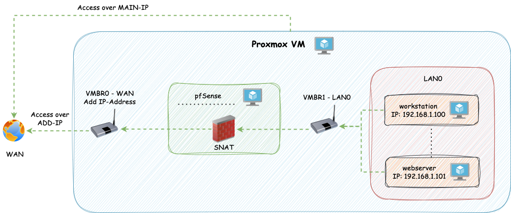

## 1. Install Proxmox on Hetzner

    ssh root@178.63.13.156

    #run
    installimage

Chose the right image:

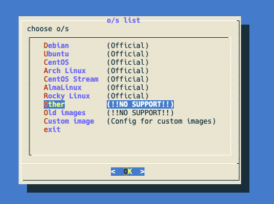
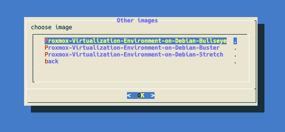

Change install config

From:

    SWRAIDLEVEL 1

To:

    SWRAIDLEVEL 0 (to use all Storage sda+sdb)

From:

    HOSTNAME Proxmox-Ve.localhost

To:

    proxmox-single.lab.local (you can call it what ever you want)

From:

    PART /boot ext3 512M
    PART lvm vg0 all

    LV vg0 root / ext3 15G
    LV vg0  swap swap swap 6G

To:

    PART /boot ext**4** 512M
    PART lvm vg0 all

    LV vg0 root / ext4 100G
    LV vg0  swap swap swap 24G  #(available RAM * 1/2)
    LV vg0 data /var/lib/vz ext4 3500G #(Remaining memory after deduction of root for storing images and containers)

The installation takes up to 15 minutes.

## 2. Set root password and disable port 111 or service

After installation a password must be assigned to the root user if access to the Hetzner machine is via ssh-key. The access will be done via the Linux PAM authentication module.

    passwd
    New password: xy...
    Retype new password:xy...

Proxmox opens port 111 by default, which is a security risk. Therefore, the port must be disabled.

    iptables -A INPUT -p tcp -m tcp --dport 111 -j DROP
    iptables -A INPUT -p udp -m udp --dport 111 -j DROP
    sudo /sbin/iptables-save

    ##if the service is not needed, then disable and mask it
    sudo systemctl disable --now rpcbind rpcbind.socket
    sudo systemctl mask rpcbind

Now open the Proxmox-Webconsole with your ordered server IP-Address (MAIN-IP) and login with root and your password:

https://178.10.10.10:8006

## 3. Add additional IP-Address and fetch Metadata

To enable routing to external networks (SNAT), you'll need to request an extra IP address, since the primary IP of the Hetzner VM doesn't support this function.

You'll need to request a MAC address for the IP address. This MAC address will be later essential for the pfsense VM that handles routing to the WAN.

## 4. Config Network

**Note:** they are a newer version of the network configuration script in the folder `script` called `network_config_updated.sh` which has Multiple IP Address Support, User Confirmation Process, Dynamic Bridge Interface Creation and Improved User Interaction. You can see the whole change under the [pull request](https://github.com/la-cc/hetzner-proxmox-single/pull/3)

Clone this git repository and execute the script:

    ./script/nework_config.sh

All necessary information (main server ip, gateway, etc.) can be taken from the hetzner robot page like this:

MAIN-IP + Meta:
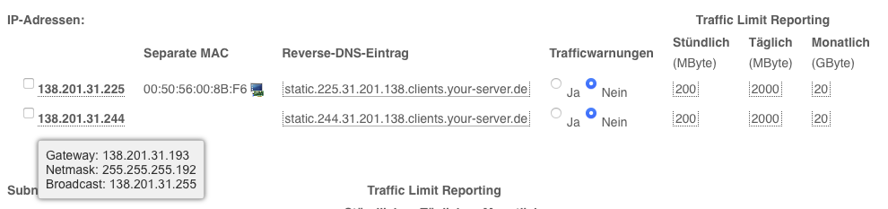
ADD-IP + Meta + MAC:
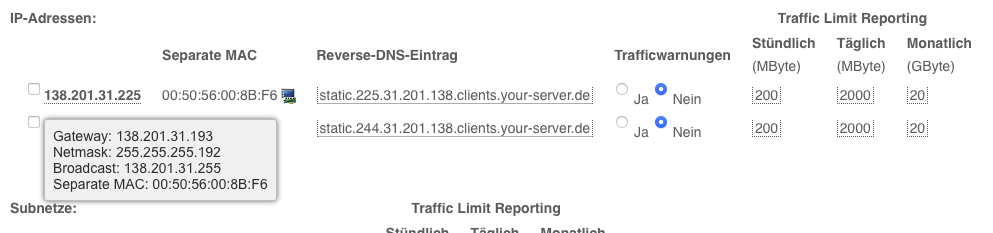

## 5. Upload images (pfsense and fedora)

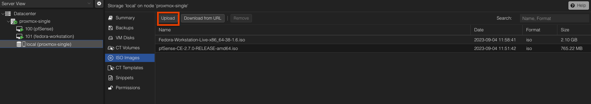

## 6. Create VM and install pfsense

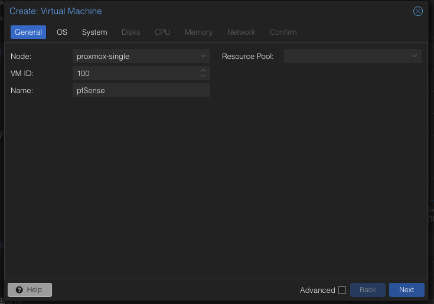
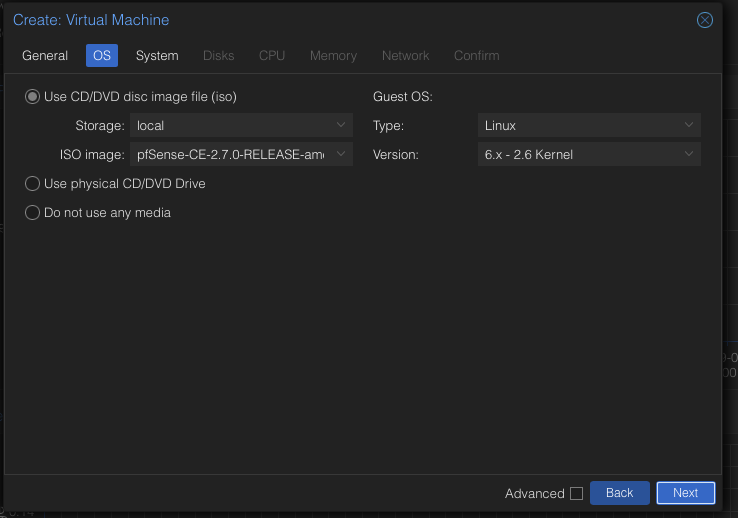
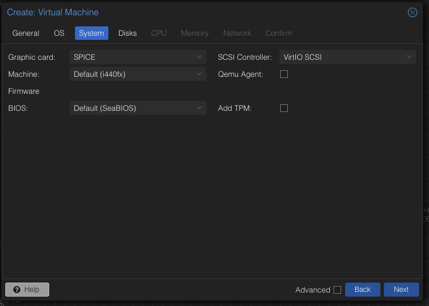
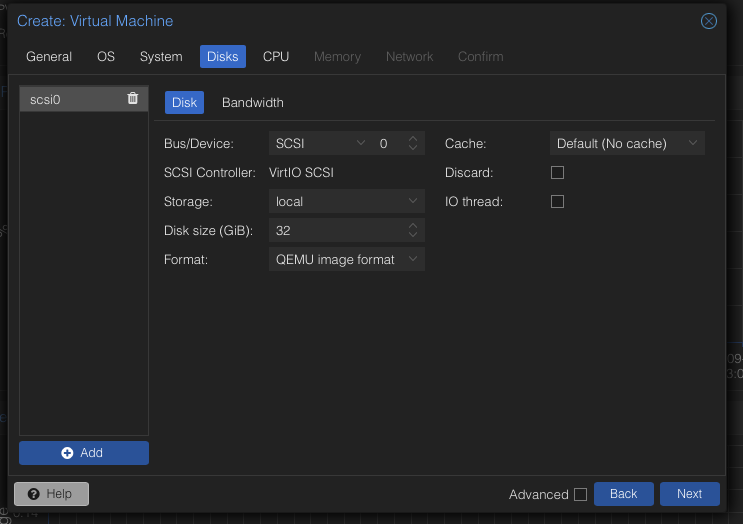
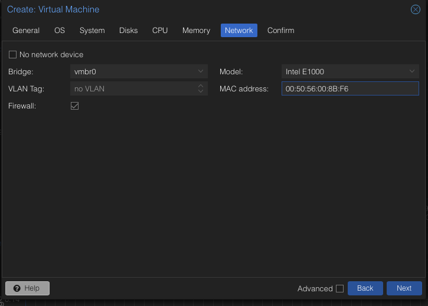
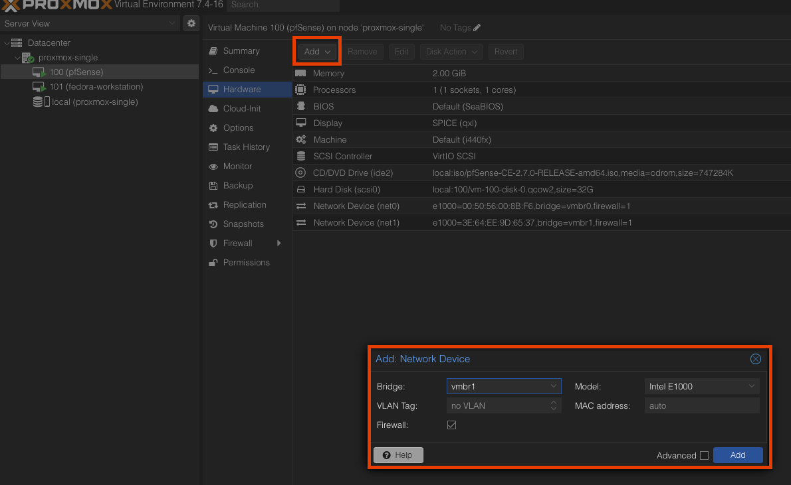
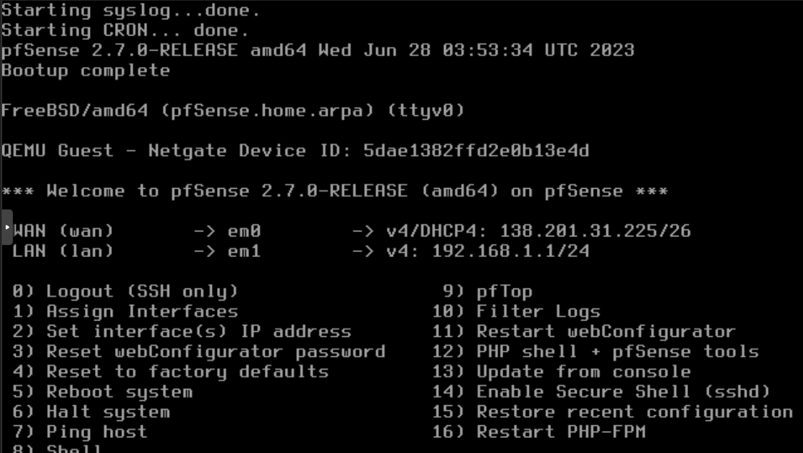

Now start the pfsense (VM) and install with default settings

## 7. Create VM and install fedora (workstation)

The steps are identical to pfsense except for the choice of bridge. There vmbr1 (DMZ/LAN) must be selected.

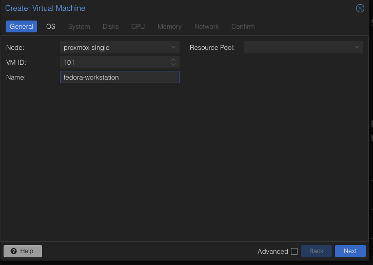
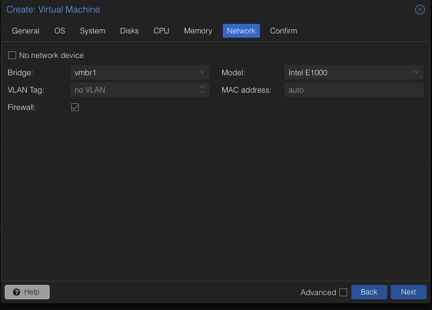
If you check the IP-Address from the created VM (in my case fedora workstation) like:
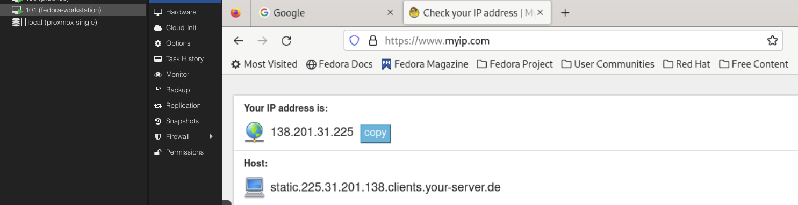
You will see the ADD-IP-Address. So SNAT is working and you can extend to config pfsense over the UI for your purpose.

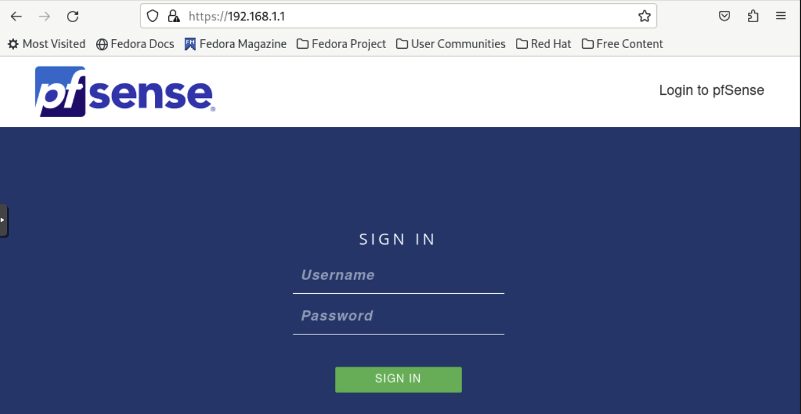

Default credentials are set to **username:** **_admin_** with **password:** **_pfsense_**.

## **Finished, enjoy your Proxmox Environment!**

# Contribution

If you're eager to contribute to this script, feel free to fork the repository and submit a pull request. Your input is valued and always welcome!

Current Contributors:

@L-U-C-K-Y
@V-JobDone
@la-cc
